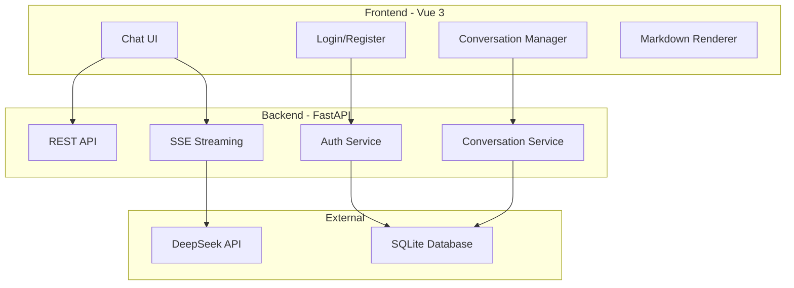
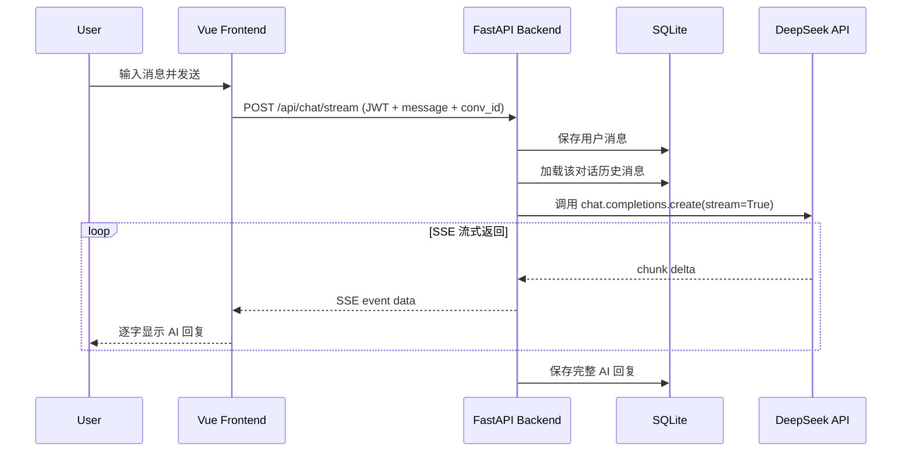

# DeepSeek 对话问答系统开发计划

## 整体架构




## 项目目录结构

```
lesson01/
├── backend/
│   ├── app/
│   │   ├── main.py              # FastAPI 入口
│   │   ├── config.py            # 配置（API Key 等）
│   │   ├── models.py            # SQLAlchemy 数据模型
│   │   ├── database.py          # 数据库连接
│   │   ├── auth.py              # JWT 认证逻辑
│   │   ├── routers/
│   │   │   ├── chat.py          # 对话相关接口
│   │   │   ├── conversation.py  # 对话管理接口
│   │   │   └── user.py          # 用户注册/登录接口
│   │   └── services/
│   │       └── deepseek.py      # DeepSeek API 调用封装
│   ├── requirements.txt
│   └── .env                     # 环境变量（API Key）
├── frontend/
│   ├── src/
│   │   ├── App.vue
│   │   ├── main.js
│   │   ├── api/                 # Axios 请求封装
│   │   │   └── index.js
│   │   ├── views/
│   │   │   ├── ChatView.vue     # 主聊天页面
│   │   │   └── LoginView.vue    # 登录/注册页面
│   │   ├── components/
│   │   │   ├── ChatMessage.vue  # 消息气泡（含 Markdown + 代码高亮）
│   │   │   ├── ChatInput.vue    # 输入框组件
│   │   │   ├── Sidebar.vue      # 侧边栏（对话列表）
│   │   │   └── CodeBlock.vue    # 代码块高亮组件
│   │   ├── stores/
│   │   │   ├── auth.js          # Pinia 用户认证状态
│   │   │   └── chat.js          # Pinia 对话状态
│   │   └── router/
│   │       └── index.js         # Vue Router 路由
│   ├── package.json
│   └── vite.config.js
└── README.md
```

## 后端功能模块

### 1. 用户认证模块 (`routers/user.py`)

- **POST /api/register** - 用户注册（用户名 + 密码，bcrypt 加密存储）
- **POST /api/login** - 用户登录，返回 JWT Token
- 使用 `python-jose` 生成 JWT，`passlib` + `bcrypt` 处理密码

### 2. 对话模块 (`routers/chat.py`)

- **POST /api/chat/stream** - 流式对话接口（SSE），接收用户消息和 conversation_id，调用 DeepSeek API 并以 Server-Sent Events 方式逐字返回
- 自动将用户消息和 AI 回复存入数据库
- 支持多轮对话：从数据库加载历史消息作为上下文发送给 DeepSeek

### 3. 对话管理模块 (`routers/conversation.py`)

- **GET /api/conversations** - 获取当前用户的对话列表
- **POST /api/conversations** - 新建对话
- **DELETE /api/conversations/{id}** - 删除对话
- **PUT /api/conversations/{id}** - 重命名对话

### 4. DeepSeek API 封装 (`services/deepseek.py`)

- 使用 `openai` Python SDK（DeepSeek API 兼容 OpenAI 格式）
- 封装 stream=True 的流式调用
- 配置 `base_url="https://api.deepseek.com"`，使用 `deepseek-chat` 模型

### 5. 数据模型 (`models.py`)

- **User**: id, username, hashed_password, created_at
- **Conversation**: id, user_id, title, created_at, updated_at
- **Message**: id, conversation_id, role(user/assistant), content, created_at

使用 SQLite + SQLAlchemy 作为数据库方案（轻量、无需额外安装）。

### 关键技术依赖

- `fastapi`, `uvicorn` - Web 框架与服务器
- `openai` - 调用 DeepSeek API（兼容 OpenAI SDK）
- `sqlalchemy`, `aiosqlite` - 数据库 ORM
- `python-jose`, `passlib`, `bcrypt` - JWT 认证与密码加密
- `sse-starlette` - Server-Sent Events 支持
- `python-dotenv` - 环境变量管理

## 前端功能模块

### 1. 登录/注册页面 (`LoginView.vue`)

- 表单切换：登录 / 注册模式
- 调用后端 API，登录成功后将 JWT 存入 localStorage
- 自动跳转到聊天页面

### 2. 主聊天页面 (`ChatView.vue`)

- 左侧边栏：对话列表，支持新建、删除、重命名对话
- 右侧主区域：消息展示 + 输入框
- 流式接收 AI 回复：通过 `EventSource` 或 `fetch` + `ReadableStream` 解析 SSE

### 3. 消息渲染 (`ChatMessage.vue`)

- 使用 `markdown-it` 解析 Markdown 语法
- 使用 `highlight.js` 实现代码语法高亮
- 代码块支持一键复制功能
- 用户消息和 AI 消息使用不同样式区分

### 4. 状态管理 (`stores/`)

- Pinia 管理用户认证状态和当前对话状态
- 路由守卫：未登录自动跳转到登录页

### 关键技术依赖

- `vue@3` + `vite` - 构建工具
- `vue-router` - 路由管理
- `pinia` - 状态管理
- `axios` - HTTP 请求
- `markdown-it` - Markdown 渲染
- `highlight.js` - 代码语法高亮

## 数据流：用户发送消息的完整流程




## UI 设计要点

- 整体风格参考 ChatGPT / DeepSeek 官方界面：深色/浅色主题可选
- 左侧固定宽度侧边栏，右侧自适应聊天区域
- 消息区域自动滚动到底部
- 输入框支持 Shift+Enter 换行，Enter 发送
- 响应式设计，移动端侧边栏可折叠
